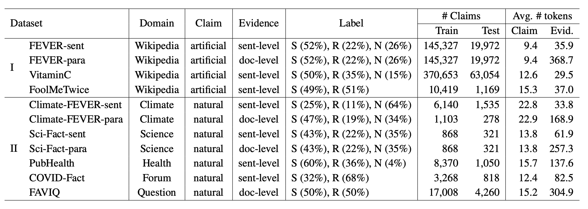

# Fact-Checking-Generalization
Data and Codes for ["Investigating Zero- and Few-shot Generalization in Fact Verification"](https://arxiv.org/abs/2309.09444) (IJCNLP-AACL 2023). 

Authors: **Liangming Pan, Yunxiang Zhang, Min-Yen Kan**. 

## Introduction

In this paper, we explore zero- and few-shot generalization for fact verification (FV), which aims to generalize the FV model trained on well-resourced domains (e.g., Wikipedia) to low-resourced domains that lack human annotations. To this end, we first construct a benchmark dataset collection which contains 11 FV datasets representing 6 domains. We conduct an empirical analysis of generalization across these FV datasets, finding that current models generalize poorly. Our analysis reveals that several factors affect generalization, including dataset size, length of evidence, and the type of claims. Finally, we show that two directions of work improve generalization: 1) incorporating domain knowledge via pretraining on specialized domains, and 2) automatically generating training data via claim generation.

## Datasets

The datasets we used are preprocessed and stored in the `./data` folder. The dataset statistics are as follows:



You could run the `dataset_stat.py` script in the `./data` folder to get the statistics of each dataset. It will be stored into the `dataset_statistics.csv` file.

## Results Reproduction

### 1. Three-class fact verification

**Training script**: 

```bash
bash scripts/train.sh <device_number> <model_name>
```

The script will iterate over all the 8 datasets in Table 2 and train the model on the corresponding dataset. The trained model will be saved to the `./model_save` folder. 

**Evaluation script**:

After training the model on all 8 datasets, you could run the following evaluation script to reproduce the results in Table 2:

```bash
bash scripts/pred.sh <device_number> <model_name>
```

The results will be saved in the `model_save/pred_output/` folder.

**Quickly collect all results**:

You could run the following script to quickly collect all the evaluation results:

```bash
python scripts/collect_results.py --model <model_name>
```

A summary of the results will be saved in a `.csv` file in the `model_save/pred_output/results/` folder.

### 2. Binary fact verification

**Training script**: 

```bash
bash scripts/train_binary.sh <device_number> <model_name>
```

The script will iterate over all the 11 datasets in Table 3 and train the model on the corresponding dataset. The trained model will be saved to the `./model_save` folder.

**Evaluation script**:

After training the model on all 11 datasets, you could run the following evaluation script to reproduce the results in Table 3:

```bash
bash scripts/pred_binary.sh <device_number> <model_name>
```

The results will be saved in the `model_save/pred_output/` folder.

**Quickly collect all results**:

You could run the following script to quickly collect all the evaluation results:

```bash
python scripts/collect_results.py --model <model_name> --exp binary
```

A summary of the results will be saved in a `.csv` file in the `model_save/pred_output/results/` folder.

## Reference
Please cite the paper in the following format if you use this code during your research.

```
@inproceedings{pan-etal-2023-investigating,
  title = {Investigating Zero- and Few-shot Generalization in Fact Verification},
  author = {Pan, Liangming and Zhang, Yunxiang and Kan, Min-Yen},
  booktitle = {International Joint Conference on Natural Language Processing and Conference of the Asia-Pacific Chapter of the Association for Computational Linguistics (IJCNLP-AACL)},
  year = {2023},
  address = {Nusa Dua, Bali},
  publisher = {Association for Computational Linguistics},
  url = {https://aclanthology.org/2023.ijcnlp-main.34},
  pages = {511--524}
}
```

## Q&A
If you encounter any problem, please either directly contact the [Liangming Pan](peterpan10211020@gmail.com) or leave an issue in the github repo.